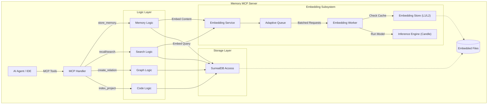
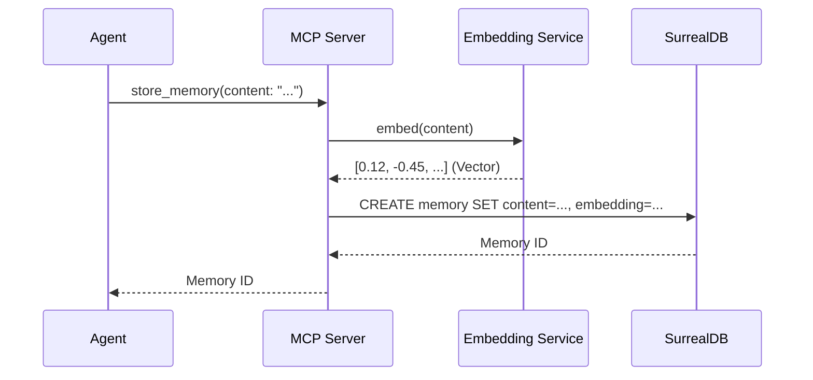
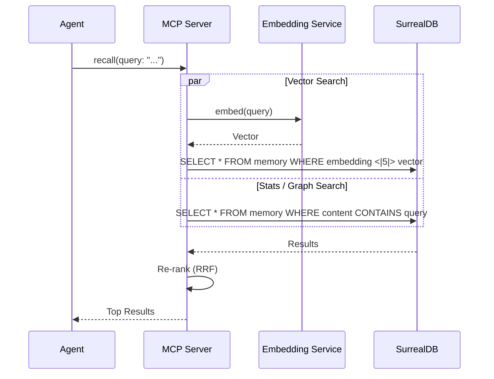

# Memory MCP Server Architecture

## High-Level Overview
Memory MCP Server is an autonomous memory system for AI agents, written in Rust. It combines semantic search (vectors), knowledge graph, and code indexing into a single binary without external dependencies.

### Key Components
1. **MCP Server**: Handles requests from clients (IDE, Agents).
2. **Embedding Architecture**: Generates vectors locally using `candle` / `ort`.
3. **Storage Layer**: Embedded SurrealDB for storing vectors, graphs, and metadata.
4. **Codebase Engine**: Indexes code using Tree-sitter (in development).

## Component Diagram (C4 Container)



## Component Details & Algorithms

### 1. Logic Layer
Responsible for request handling, routing, and business logic implementation.

*   **Reciprocal Rank Fusion (RRF)**: Algorithm for merging search results from different sources (Vector Search, BM25, Knowledge Graph).
    *   *Why*: Vector search is good for semantics ("meaning"), BM25 for exact keyword matches, and Graph for relationships. RRF allows taking the best of all three worlds without complex weight tuning.
    *   *Formula*: `score = 1.0 / (k + rank)`
*   **BM25**: Text search algorithm (Okapi BM25). Implemented on top of SurrealDB indexes.

### 2. Embedding Subsystem
Critical component for semantic search. Operates autonomously.

*   **Adaptive Queue**: Smart queue regulating vectorization request rate (Backpressure).
    *   *Algorithm*: Monitors queue depth and slows down new requests (`THROTTLE_DELAY_MS`) if the queue is filled > 80% (`HIGH_WATERMARK`).
    *   *Why*: Prevents OOM (Out of Memory) during massive file indexing.
*   **Inference Engine (Candle)**: Uses the `candle` library (Huggingface) to run BERT-like models (nomic-embed, e5) on CPU. Does not require Python.
*   **L1/L2 Cache**:
    *   L1: LRU Cache in RAM for most frequent requests.
    *   L2: Disk cache (Sled/SurrealDB) to avoid re-vectorizing unchanged content.

### 3. Graph Algorithms
Used for analyzing relationships between entities (files, functions, notes).

*   **Personalized PageRank (PPR)**: Algorithm for ranking graph nodes relative to "seed" nodes.
    *   *Application*: When a user searches for "Authorization", we find the "Authorization" node, and PPR finds all related concepts (e.g., "Login", "JWT", "OAuth"), even if the text doesn't contain the word "Authorization".
    *   *Hub Dampening*: Modification to reduce the weight of "super-nodes" (linked to everything) to avoid noise.
*   **Leiden Algorithm**: Community Detection algorithm.
    *   *Why*: Groups closely related files or concepts into clusters. Helps understand the modular structure of the project.

### 4. Codebase Engine
Responsible for understanding code.

*   **Tree-Sitter Chunking**: Smart code splitting into fragments (chunks) based on Abstract Syntax Tree (AST), rather than just lines.
    *   *Logic*: Respects function and class boundaries. Large functions are broken down into smaller logical blocks, preserving context.
    *   *Why*: Vector search works better with logically complete code pieces than with arbitrary text slices.
*   **Content Hashing (Blake3)**: Fast hashing for deduplication. If a file hasn't changed, it's not re-indexed.
*   **Index Filter (`IndexFilterConfig`)**: Controls which files are included or excluded during indexing via glob patterns.
    *   `include_patterns: Vec<String>` — only files matching at least one pattern are indexed (empty = include all).
    *   `exclude_patterns: Vec<String>` — files matching any pattern are skipped; excludes override includes.
    *   **Config defaults**: set via environment variables `CODE_INDEX_INCLUDE_PATTERNS` and `CODE_INDEX_EXCLUDE_PATTERNS` (comma-separated glob lists).
    *   **Per-call MCP overrides**: `index_project` and `project_info(action="index")` accept `include_patterns` and `exclude_patterns` parameters.
        *   `Some(vec)` — replaces the config default for that call.
        *   `None` — uses the config default.
        *   `Some([])` — disables filtering for that side (include all / exclude nothing).
    *   **Compile-before-cleanup**: invalid glob patterns are rejected before any destructive indexing work begins.
    *   **Filter snapshot**: the active filter is persisted in `IndexStatus` to ensure incremental re-index consistency.

## Data Flow: Store Memory



## Data Flow: Search (Recall / Hybrid Search)



## Module Structure (Crate Structure)

* `src/main.rs`: Entry point, CLI initialization, and services.
* `src/server/`: MCP protocol implementation and tool routing.
* `src/embedding/`: Wrapper around `candle` for local model inference.
* `src/storage/`: Abstraction over SurrealDB.
* `src/graph/`: Graph algorithms (PageRank, Community Detection).
* `src/codebase/`: Code indexing and chunking logic.

## Plugin-Facing MCP Contract Notes

Phase 5A freezes the public integration contract for the current code/project read surfaces without introducing new product capabilities.

### Additive compatibility policy

- Public MCP responses use additive `contract` and `summary` metadata.
- Clients must ignore unknown fields and unknown enum values.
- Internal DB record shapes and local edge/chunk IDs are not public contract.

### Canonical reason taxonomy

`summary.partial.reason_code` is the machine-readable contract field for partial/degraded/unsupported states. The current exported values are:

- `missing`
- `stale`
- `partial`
- `degraded`
- `invalid_locator`
- `generation_mismatch`
- `unsupported`

Legacy string `summary.partial.reason` values are still emitted for compatibility, but plugin logic should prefer `reason_code`.

### Projection locator lifecycle

`project_info(action="projection")` returns an on-demand export-only projection plus a locator record. That locator is intentionally limited:

- scope: same-process ephemeral projection registry
- opaque: clients must not parse locator internals as contract
- non-persistable: locators are convenience handles, not durable IDs
- not generation-stable: a locator is bound to the semantic generation captured at projection creation time
- same-process readback only: `project_info(action="projection_by_locator")` resolves only locators present in the current process registry

The locator record now includes typed lifecycle and lookup metadata:

- `locator.lifecycle.*` describes survivability, scope, and persistence guarantees
- `locator.lookup.state` distinguishes `created`, `resolved`, and `missing`
- `locator.lookup.reason_code` is populated on structured miss/failure cases such as `invalid_locator`

### Stable vs transient identities

- Memory APIs: public memory IDs are stable read/list/search identities.
- Symbol APIs: symbol IDs are stable project-scoped identities.
- Code recall APIs: `results[].id` is local-only; the stable re-find locator is `project_id + file_path + start_line + end_line`.
- Projection locators: transient handles only, never promoted to stable public identity.

## Memory Migration: JSONL MCP Workflow

### Overview

`export_memory` and `import_memory` are MCP-level tools that move memory records between server instances or project namespaces. The entire payload travels inline as a JSONL string inside the tool request and response. There are no filesystem paths, local files, temp files, or URLs involved at any point.

### Layering

```
MCP Handler (handler.rs)
  └── Logic Layer (logic/memory.rs)
        ├── export_memory: validates options, calls storage export, serializes records to JSONL
        └── import_memory: parses JSONL, validates records, calls storage import with conflict/remap options
              └── Storage Layer (storage/traits.rs + memory_ops.rs)
                    ├── export_memories: queries by namespace (project scope), applies valid_only / include_invalidated gates
                    └── import_memories: plans conflict detection, executes dry-run or live write
```

The handler is thin: it forwards `ExportMemoryParams` / `ImportMemoryParams` directly into the logic layer and returns the result. All business rules live in the logic and storage layers.

### Project scope

Memory records have no separate `project_id` field. The storage layer maps `project_id` to the memory `namespace` field for both export and import. Export is always scoped to a single project; cross-project export is not supported.

### Export behavior

- Default: `valid_only=true`, `include_invalidated=false`. Only non-invalidated records are exported.
- Archival opt-in: set `valid_only=false` **and** `include_invalidated=true`. Both flags are required; setting `include_invalidated=true` alone while `valid_only=true` is rejected.
- Raw embeddings, vectors, `content_hash`, and `embedding_state` are never included. The `MigrationMemoryRecord` DTO carries only portable content and metadata fields.
- The response `jsonl` field is a newline-delimited string. Each line is one JSON object with `schema_version`, `record_type`, `id`, `content`, `memory_type`, timestamps, and optional scope/metadata fields.
- `truncated=true` in the response means a `limit` was applied and more records exist.

### Import behavior

- Default: `dry_run=false`, `conflict_strategy=remap`, `preserve_project_id=false`.
- `dry_run=true` parses and validates every record, computes `id_mappings`, and returns the full report without writing anything to the database.
- `conflict_strategy=remap` (default): records whose source IDs already exist in the target DB receive new IDs. Old/new pairs are reported in `id_mappings`.
- `conflict_strategy=skip`: conflicting records are silently dropped.
- `conflict_strategy=fail`: the import aborts on the first conflict.
- `preserve_project_id=false` (default): the target `project_id` is applied to all imported records, overriding the source namespace.
- Invalidated records are skipped unless `allow_invalidated=true`.
- Imported records are written without embedding payloads. The embedding service re-indexes them through the normal lifecycle after import.

### Timestamp and import metadata

- `created_at`, `updated_at`, `valid_from`, and `valid_until` are preserved from the source record.
- `superseded_by` links are rewritten to use the remapped target IDs when `conflict_strategy=remap`.
- Source `metadata` is preserved and the import adds audit metadata under `metadata.migration` on the stored record.
- The audit object includes `schema_version`, `source_id`, `imported_id`, `target_project_id`, `source_project_id`, `imported_at`, and `conflict_strategy`.
- If the source metadata already contains `migration`, that value is preserved under `metadata.source_migration` before the new audit object is written. Non-object source metadata is preserved under `metadata.source_metadata`.

### Non-goals

The following are explicitly out of scope and not supported:

- **Filesystem path migration**: no `path`, `url`, or `file` parameter exists on either tool.
- **DB backup/restore**: this is not a SurrealDB table copy or raw database backup mechanism.
- **Vector import**: embedding payloads are not transferred. Imports trigger re-embedding through the current service.
- **Overwrite/replace-all**: there is no overwrite mode. Conflict handling is `remap`, `skip`, or `fail`.
- **`migrate_memory` tool**: no such tool exists. The migration surface is `export_memory` + `import_memory`.
- **Code index migration**: only memory records are supported. Code chunks, symbols, and knowledge graph entities are not exported or imported by these tools.
- **CI integration**: these tools are MCP-level interactive tools, not CI pipeline primitives.
