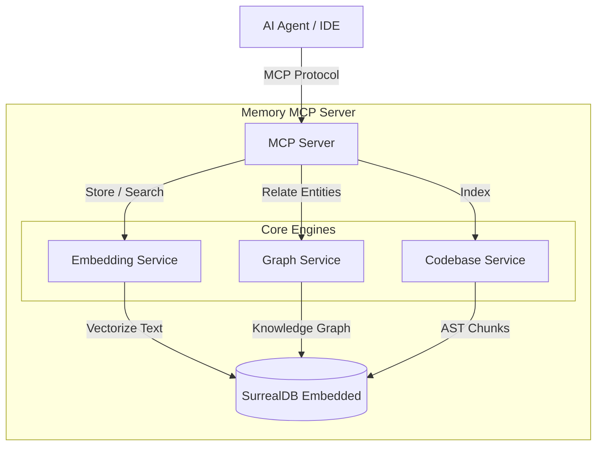

# 🧠 Memory MCP Server

[](https://github.com/pomazanbohdan/memory-mcp-1file/actions/workflows/release.yml)
[](https://github.com/pomazanbohdan/memory-mcp-1file/pkgs/container/memory-mcp-1file)
[](https://opensource.org/licenses/MIT)
[](https://www.rust-lang.org)
[](#)

A high-performance, **pure Rust** Model Context Protocol (MCP) server that provides persistent, semantic, and graph-based memory for AI agents.

Works perfectly with:
*   **Claude Desktop**
*   **Claude Code** (CLI)
*   **Gemini CLI**
*   **Cursor**
*   **OpenCode**
*   **Cline** / **Roo Code**
*   Any other MCP-compliant client.

### 🏆 The "All-in-One" Advantage

Unlike other memory solutions that require a complex stack (Python + Vector DB + Graph DB), this project is **a single, self-contained executable**.

*   ✅ **No External Database** (SurrealDB is embedded)
*   ✅ **No API Keys, No Cloud, No Python** — Everything runs **100% locally** via an embedded ONNX runtime. The embedding model is baked into the binary and runs on CPU. Nothing leaves your machine.
*   ✅ **Zero Setup** (Just run one Docker container or binary)

It combines:
1.  **Vector Search** (FastEmbed) for semantic similarity.
2.  **Knowledge Graph** (PetGraph) for entity relationships.
3.  **Code Indexing** with **symbol graph** (calls, extends, implements) for deep codebase understanding.
4.  **Hybrid Retrieval** (Reciprocal Rank Fusion) for best results.
5.  **Explicit consolidation** for exact duplicate memories via replacement links, without silently changing write semantics.
6.  **Preview / Apply Alignment** with `plan_fingerprint`, plus matched-summary and execution-summary fields so consolidation can be previewed, verified, and audited before and after execution.
7.  **Read-side Consolidation Traceability** so `get_memory`, `list_memories`, and `get_valid` expose a normalized `consolidation_trace` summary instead of forcing callers to reconstruct lifecycle state from raw fields.
8.  **Replacement Lineage Navigation** so read APIs also expose a compact `replacement_lineage` summary for following supersession chains without reconstructing them client-side.
9.  **Operator Attention Summaries** so preview/apply/read responses surface a compact `attention_summary` for multi-match, partial-supersede, lineage-cycle, truncation, and fingerprint-check signals without requiring callers to infer risk from raw fields.
10. **Retrieval/Read Truth Alignment** so `search_memory` and `recall` also surface consolidation truth summaries instead of requiring a second hop to `get_memory` before a caller can see lifecycle state.
11. **Plan Diagnostics Echo** so `preview_consolidate_memory` and `consolidate_memory` return a normalized `plan_diagnostics` view of the fingerprint inputs, making stale-plan mismatches explainable without reconstructing the plan by hand.
12. **Hash-First Duplicate Lookup** so exact-duplicate consolidation can narrow candidates by `content_hash` first, while still falling back to exact-content matching for older memories that predate create-time hashing.
13. **Lookup Diagnostics** so preview/apply responses explicitly show whether duplicate detection came from `hash-first` narrowing or `exact-content` fallback for legacy no-hash memories.
14. **Operator Summary** so preview/apply/read/retrieval responses expose one compact `operator_summary` entrypoint that tells clients which diagnostic section to inspect first.

### 🏗️ Architecture



> **[Click here for the Detailed Architecture Documentation](./ARCHITECTURE.md)**

---

## 🤖 Agent Integration (System Prompt)

Memory is useless if your agent doesn't check it. To get the "Long-Term Memory" effect, you must instruct your agent to follow a strict protocol.

We provide a battle-tested **[Memory Protocol (AGENTS.md)](./AGENTS.md)** that you can adapt.

### 🛡️ Core Workflows (Context Protection)

The protocol implements specific flows to handle **Context Window Compaction** and **Session Restarts**:

1.  **🚀 Session Startup**: The agent *must* search for `TASK: in_progress` immediately. This restores the full context of what was happening before the last session ended or the context was compacted.
2.  **⏳ Auto-Continue**: A safety mechanism where the agent presents the found task to the user and waits (or auto-continues), ensuring it doesn't hallucinate a new task.
3.  **🔄 Triple Sync**: Updates **Memory**, **Todo List**, and **Files** simultaneously. If one fails (e.g., context lost), the others serve as backups.
4.  **🧱 Prefix System**: All memories use prefixes (`TASK:`, `DECISION:`, `RESEARCH:`) so semantic search can precisely target the right type of information, reducing noise.

These workflows turn the agent from a "stateless chatbot" into a "stateful worker" that survives restarts and context clearing.

### Recommended System Prompt Snippet

Instead of scattering instructions across IDE-specific files (like `.cursorrules`), establish `AGENTS.md` as the **Single Source of Truth**.

Instruct your agent (in its base system prompt) to:
1.  **Read `AGENTS.md`** at the start of every session.
2.  **Follow the protocols** defined therein.

Here is a minimal reference prompt to bootstrap this behavior:

```markdown
# 🧠 Memory & Protocol
You have access to a persistent memory server and a protocol definition file.

1.  **Protocol Adherence**:
    - READ `AGENTS.md` immediately upon starting.
    - Strictly follow the "Session Startup" and "Sync" protocols defined there.

2.  **Context Restoration**:
    - Run `search_text("TASK: in_progress")` to restore context.
    - Do NOT ask the user "what should I do?" if a task is already in progress.
```

### Why this matters?
Without this protocol, the agent loses context after compaction or session restarts. With this protocol, it maintains the **full context of the current task**, ensuring no steps or details are lost, even when the chat history is cleared.

---

## 🔌 Client Configuration

### Universal Docker Configuration (Any IDE/CLI)

To use this MCP server with any client (**Claude Code**, **OpenCode**, **Cline**, etc.), use the following Docker command structure.

**Key Requirements:**
1.  **Memory Volume**: `-v mcp-data:/data` (Persists your graph, embeddings, **and cached model weights**)
2.  **Project Volume**: `-v $(pwd):/project:ro` (Allows the server to read and index your code)
3.  **Init Process**: `--init` (Ensures the server shuts down cleanly)
4.  **HTTP Server-Visible Paths**: When running in HTTP mode (default), the server can only index paths that are mounted into the container or otherwise visible to the server process. Local paths on the client machine are not automatically accessible.

> [!TIP]
> **One volume persists everything**: The single `-v mcp-data:/data` mount covers both the SurrealDB database **and** the ~1.2 GB embedding model (stored under `/data/models/`). There is no need for a separate volume for `/data/models` — it is already a subdirectory of `/data` and is preserved automatically. Without a named volume, Docker creates a new anonymous volume on each `docker run`, causing the model to re-download (~1.2 GB) every time.

#### HTTP Mode (Default / Remote)

When using the server over HTTP (e.g., for a remote agent or a containerized backend), ensure your project files are mounted into the container so the server can index them.

**Important Security & Scope Notes:**
1. **Server-Visible Paths**: The server process must be able to see the paths you request to index. You must mount the project directory and specify its location using `PROJECT_PATH` or `--project-path`.
2. **No Remote Uploads**: The server does not support uploading client-local files or indexing client-side paths over the network. All indexed code must be visible to the server's local filesystem (or mounted volume).
3. **No Header/Query Binding**: Project binding is currently only supported via explicit `project_info` tool actions. Binding via HTTP headers or query parameters is not supported.

```bash
docker run -d \
  --name memory-mcp \
  --memory=3g \
  -p 8080:8080 \
  -v mcp-data:/data \
  -v /absolute/path/to/host/project:/project:ro \
  -e PROJECT_PATH=/project \
  ghcr.io/pomazanbohdan/memory-mcp-1file:latest
```

> [!IMPORTANT]
> **HTTP Server-Visible Paths**: The server process must be able to see the paths you request to index. When running in Docker, you must mount the project directory and specify its location using `PROJECT_PATH` or `--project-path`.

#### Code Intelligence Startup Behavior

The server uses a deterministic priority matrix to establish the primary project root for code intelligence:

1.  **Explicit Configuration**: If `--project-path` or `PROJECT_PATH` is set and the path exists, it is used as the primary root.
2.  **Missing Root**: If a path is explicitly configured but missing, the server continues startup but reports **missing-root** or **degraded** diagnostics. It will **not** silently fall back to other paths.
3.  **Default Fallback**: If no path is configured and `/project` exists, the server uses `/project` and preserves the legacy `project_id="project"` for compatibility.
4.  **Disabled**: If no path is configured and `/project` is missing, code intelligence is disabled (reported in diagnostics), but the server remains functional for other memory tools.

#### Code Intelligence Language Contract

This code intelligence path is static and tree-sitter-based. It does **not** require SourceKit, clangd, Kotlin LSP, Gradle model parsing, Xcode project parsing, or compiler invocation.

It also stays syntactic rather than compiler-accurate: there is no overload resolution, macro expansion, dynamic dispatch resolution, generated-code awareness, build-configuration awareness, type inference, or compiler-accurate call graph construction.

| Language | Status | Contract |
|---|---|---|
| Rust | Supported now | AST-based indexing with symbol and relation extraction. |
| Python | Supported now | AST-based indexing with symbol and relation extraction. |
| JavaScript | Supported now | AST-based indexing with symbol and relation extraction. |
| TypeScript | Supported now | AST-based indexing with symbol and relation extraction. |
| Go | Supported now | AST-based indexing with symbol and relation extraction. |
| Java | Supported now | AST-based indexing with symbol and relation extraction. |
| Dart | Supported now | AST-based indexing with symbol and relation extraction. |
| C | Supported now | tree-sitter-backed syntactic indexing for functions, structs/enums/typedefs, includes, and obvious direct calls; no compiler semantics. |
| C++ | Supported now | tree-sitter-backed syntactic indexing for namespaces, classes/methods/functions, includes, and obvious direct calls; no compiler semantics. |
| Swift | Supported now | tree-sitter-backed syntactic indexing for imports, classes/structs/enums/protocols, methods/functions, and obvious direct calls; no compiler semantics. |
| Kotlin | Supported now | tree-sitter-backed syntactic indexing for package/imports, classes/interfaces/objects, methods/functions, and obvious direct calls; no compiler semantics. |
| Objective-C | Supported now | tree-sitter-backed syntactic indexing for imports, classes/protocols, methods, C-style calls, and obvious message sends; no compiler semantics. |

For `.h` files, detection is heuristic and ordered exactly as: Objective-C markers first, then C++ markers, then C fallback.

#### Code Intelligence Verification Commands

If you need to validate parser/scanner behavior locally, run:

```bash
cargo check
cargo test codebase::scanner -- --nocapture
cargo test codebase::parser -- --nocapture
cargo test
```

#### JSON Configuration (Claude Desktop, etc.)

Add this to your configuration file (e.g., `claude_desktop_config.json`):

```json
{
  "mcpServers": {
    "memory": {
      "command": "docker",
      "args": [
        "run",
        "--init",
        "-i",
        "--rm",
        "--memory=3g",
        "-v", "mcp-data:/data",
        "-v", "/absolute/path/to/your/project:/project:ro",
        "ghcr.io/pomazanbohdan/memory-mcp-1file:latest",
        "--stdio"
      ]
    }
  }
}
```

> **Note:** Replace `/absolute/path/to/your/project` with the actual path you want to index. In some environments (like Cursor or VSCode extensions), you might be able to use variables like `${workspaceFolder}`, but absolute paths are most reliable for Docker.

### Cursor (Specific Instructions)

1.  Go to **Cursor Settings** > **Features** > **MCP Servers**.
2.  Click **+ Add New MCP Server**.
3.  **Type**: `stdio`
4.  **Name**: `memory`
5.  **Command**:
    ```bash
    docker run --init -i --rm --memory=3g -v mcp-data:/data -v "/Users/yourname/projects/current:/project:ro" ghcr.io/pomazanbohdan/memory-mcp-1file:latest --stdio
    ```
    *(Remember to update the project path when switching workspaces if you need code indexing)*

### OpenCode / CLI

```bash
docker run --init -i --rm --memory=3g \
  -v mcp-data:/data \
  -v $(pwd):/project:ro \
  ghcr.io/pomazanbohdan/memory-mcp-1file:latest \
  --stdio
```

> [!NOTE]
> The published Docker image defaults to **HTTP SSE** mode for standalone/server use. When wiring it into MCP desktop or CLI clients, append `--stdio` as shown above so the container speaks the stdio transport the client expects.

#### HTTP Health Checks

In HTTP SSE mode, `GET /health` is a liveness probe for the HTTP process and returns `200 OK` when the server is accepting requests. It intentionally does not query the embedded database, so extension heartbeats remain stable while long code-indexing or embedding jobs are using storage heavily. Use the MCP `get_status` tool when you need database or embedding readiness details.

### NPX / Bunx (No Docker required)

You can run the server directly via `npx` or `bunx`. The npm package automatically downloads the correct pre-compiled binary for your platform.

#### Claude Desktop

Add to `claude_desktop_config.json`:

```json
{
  "mcpServers": {
    "memory": {
      "command": "npx",
      "args": ["-y", "memory-mcp-1file"]
    }
  }
}
```

#### Claude Code (CLI)

```bash
claude mcp add memory -- npx -y memory-mcp-1file
```

#### Cursor

1.  Go to **Cursor Settings** > **Features** > **MCP Servers**.
2.  Click **+ Add New MCP Server**.
3.  **Type**: `command`
4.  **Name**: `memory`
5.  **Command**: `npx -y memory-mcp-1file`

Or add to `.cursor/mcp.json`:

```json
{
  "mcpServers": {
    "memory": {
      "command": "npx",
      "args": ["-y", "memory-mcp-1file"]
    }
  }
}
```

#### Windsurf / VS Code

Add to your MCP settings:

```json
{
  "mcpServers": {
    "memory": {
      "command": "npx",
      "args": ["-y", "memory-mcp-1file"]
    }
  }
}
```

#### Bun

```json
{
  "mcpServers": {
    "memory": {
      "command": "bunx",
      "args": ["memory-mcp-1file"]
    }
  }
}
```

> **Note:** Unlike Docker, `npx`/`bunx` runs the binary **locally** — it already has access to your filesystem, so no directory mounting is needed. To customize the data storage path, pass `--data-dir` via args:
> ```json
> "args": ["-y", "memory-mcp-1file", "--", "--data-dir", "/path/to/data"]
> ```

### Gemini CLI

Add to your `~/.gemini/settings.json`:

```json
{
  "mcpServers": {
    "memory": {
      "command": "npx",
      "args": ["-y", "memory-mcp-1file"]
    }
  }
}
```

Or with Docker:

```json
{
  "mcpServers": {
    "memory": {
      "command": "docker",
      "args": [
        "run", "--init", "-i", "--rm", "--memory=3g",
        "-v", "mcp-data:/data",
        "-v", "${workspaceFolder}:/project:ro",
        "ghcr.io/pomazanbohdan/memory-mcp-1file:latest",
        "--stdio"
      ]
    }
  }
}
```

---

## ✨ Key Features

- **Session-Scoped Code Scoping**: The server now supports binding an HTTP MCP session to a specific project. Once bound, code-intelligence tools (`recall_code`, `search_symbols`) automatically scope their operations to that project unless an explicit `project_id` is provided. This state is stored in process memory only and does not survive server restarts.
- **Governed Memory Retrieval**: Memory APIs now share first-class optional filters for `user_id`, `agent_id`, `run_id`, `namespace`, `memory_type`, metadata, and time windows. `list_memories` uses the same governance path and returns a filtered `total`.
- **Memory Lexical Engine**: Memory BM25-style retrieval now uses a reusable in-memory lexical index that is warmed from DB at startup and kept in sync by memory CRUD / invalidation flows, instead of rebuilding the lexical model on every request.
- **Layered Diagnostics**: Memory search/recall diagnostics expose retrieved candidates, post-filter hits, and returned hits; `metadata_filter` is explicitly reported as post-query subset matching.
- **Importance-aware Recall**: `importance_score` participates in memory ranking, so promoted memories can outrank equally matching low-priority ones.
- **Replacement Links Preserved**: `invalidate(..., superseded_by=...)` now round-trips on reads, so replacement chains survive retrieval and inspection.
- **Consolidation Preview**: `preview_consolidate_memory` shows exact-duplicate matches, replacement scope, and supersede reason before any write occurs.
- **Graph Memory**: Tracks entities (`User`, `Project`, `Tech`) and their relations (`uses`, `likes`). Supports PageRank-based traversal.
- **Code Intelligence**: Indexes local project directories (AST-based chunking) for Rust, Python, TypeScript, JavaScript, Go, Java, **Dart/Flutter**, C, C++, Swift, Kotlin, and Objective-C using static tree-sitter-backed syntactic indexing. Tracks **calls, imports, extends, implements, and mixin** relationships between symbols when the grammar supports them.
- **Deterministic Code Scoping**: Code intelligence tools use a strict project resolution order:
  1. **Explicit `project_id`**: Always takes highest priority if provided in the tool arguments.
  2. **Session Binding**: If no explicit `project_id` is provided, the server uses the project bound to the current HTTP MCP session.
  3. **Breadth Fallback**: If neither an explicit ID nor a session binding exists, the server performs a cross-project search (if `project_id=None` behavior is supported by the tool).
  *Note: Stale session bindings (e.g., project deleted) return empty success with `reason_code="stale"` and `binding_state="stale_binding"` without broadening to cross-project search.*
- **Plugin-Facing Contract Freeze**: Code/project read surfaces expose additive `contract` + `summary` metadata with a machine-readable `reason_code` taxonomy (`missing`, `stale`, `partial`, `degraded`, `invalid_locator`, `generation_mismatch`, `unsupported`) while preserving legacy string `reason` fields for compatibility.
- **Explicit Projection Locator Lifecycle**: `project_info(action="projection")` returns an ephemeral locator record with typed lifecycle and lookup metadata, and `project_info(action="projection_by_locator")` returns the same contract on resolve/miss without promoting locators to stable public IDs.
- **Temporal Validity**: Memories can have `valid_from` and `valid_until` dates.
- **SurrealDB Backend**: Fast, embedded, single-file database.

---

## 🛠️ Tools Available

The server exposes **23 tools** to the AI model, organized into logical categories.

### 🧠 Core Memory Management
| Tool | Description |
|------|-------------|
| `store_memory` | Store a new memory with content, optional scope fields, metadata, and optional `importance_score`. Read/list surfaces now also expose additive `contract` + `summary` metadata. |
| `update_memory` | Update memory fields, including scope and `importance_score`. |
| `delete_memory` | Delete memory by ID. |
| `consolidate_memory` | Store a new memory and explicitly supersede exact duplicates within the same optional scope/type boundary. |
| `preview_consolidate_memory` | Preview exact-duplicate consolidation within the same optional scope/type boundary without writing any changes. |
| `list_memories` | List memories (newest first) with optional scope/type/metadata/time filters; `total` is the filtered total. Also returns additive `contract` + normalized `summary` metadata. |
| `get_memory` | Get full memory by ID. Memory IDs are stable public identities; response includes additive contract and summary metadata. |
| `invalidate` | Soft-delete memory, optionally linking replacement via `superseded_by`. |
| `get_valid` | Get valid memories. Supports optional timestamp (ISO 8601), scope filters, memory_type, metadata_filter, and event/ingestion ranges. Response includes additive contract and summary metadata. |
| `export_memory` | Export memories for a project as inline JSONL using the public migration contract. Returns a `jsonl` string in the response body — no filesystem path or file is involved. By default exports only valid (non-invalidated) records. To include invalidated records, set `valid_only=false` and `include_invalidated=true`. Raw embeddings and vectors are never exported. |
| `import_memory` | Import memories from an inline JSONL string using the public migration contract. The `jsonl` field in the request carries the JSONL content directly — no filesystem path or file is involved. Defaults: `dry_run=false`, `conflict_strategy=remap`, `preserve_project_id=false`. Set `dry_run=true` to validate and preview without writing anything. Invalidated records are skipped unless `allow_invalidated=true`. Imported records are re-embedded by the current service; no vector payloads are preserved. |

### 🔎 Search & Retrieval
| Tool | Description |
|------|-------------|
| `recall` | Hybrid memory retrieval (vector+BM25+graph via RRF) with additive diagnostics and contract metadata. |
| `search_memory` | Memory search (`query`, optional `mode`: `vector` or `bm25`) with optional filters and additive contract/summary metadata. |

### 🕸️ Knowledge Graph
| Tool | Description |
|------|-------------|
| `knowledge_graph` | Knowledge graph ops. Actions: create_entity(name, entity_type?, description?) \| create_relation(from_entity, to_entity, relation_type, weight?) \| get_related(entity_id, depth?, direction?) \| detect_communities(). `create_relation.from_entity` and `to_entity` must be entity IDs returned by `create_entity`, not display names. get_related returns preferred exported nodes/edges plus additive contract and summary metadata; raw entities/relations remain compatibility fields. |

### 💻 Codebase Intelligence
| Tool | Description |
|------|-------------|
| `index_project` | Index codebase directory for code search. Retrying a previously failed full index requires `force=true` and `confirm_failed_restart=true`. |
| `delete_project` | Delete indexed project. |
| `recall_code` | Hybrid code retrieval (vector+BM25+graph) with additive `contract`/`summary` metadata. `results[].id` is a local chunk-record reference; stable refind locator is `project_id + file_path + start_line + end_line`. |
| `search_symbols` | Symbol lookup by name with additive contract/summary metadata. |
| `symbol_graph` | Symbol relationship traversal with additive contract/summary metadata; `frontier` is an unexpanded boundary hint, not a cursor. |
| `project_info` | Project indexing information. Actions: list() \| index(path, force?, confirm_failed_restart?) \| status(project_id) \| stats(project_id) \| projection(project_id) \| projection_by_locator() \| bind(project_id) \| unbind() \| binding_status(). bind/unbind/status actions manage session-scoped project binding for HTTP MCP clients. Responses include additive contract/summary metadata, including lifecycle, generation, and projection/materialization fields. |

### 📦 Memory Migration (export\_memory / import\_memory)

These two tools let you move memories between server instances or namespaces using inline JSONL. The JSONL string travels inside the MCP tool request and response — there are no filesystem paths, local files, or URLs involved.

#### Export

`export_memory` requires a `project_id` and returns a `jsonl` field in the response. Each line is one `MigrationMemoryRecord` JSON object.

**Default behavior** (valid records only):

```json
{
  "project_id": "my-project"
}
```

**Archival export** (include invalidated records — requires both flags):

```json
{
  "project_id": "my-project",
  "valid_only": false,
  "include_invalidated": true
}
```

Setting `valid_only=true` while also setting `include_invalidated=true` is rejected. You must set both to opt into archival export.

Additional optional filters: `user_id`, `agent_id`, `run_id`, `memory_type`, `metadata_filter`, `valid_at`, `event_after`, `event_before`, `ingestion_after`, `ingestion_before`, `limit`.

Raw embeddings and vectors are never included in the export. The `jsonl` field in the response is the portable payload.

#### Import

`import_memory` requires a `project_id` and a `jsonl` field containing the JSONL string from a prior export.

**Default import** (live write, remap conflicting IDs):

```json
{
  "project_id": "target-project",
  "jsonl": "<paste jsonl string here>"
}
```

**Dry-run** (validate and preview without writing anything):

```json
{
  "project_id": "target-project",
  "jsonl": "<paste jsonl string here>",
  "dry_run": true
}
```

When `dry_run=true`, the tool parses and validates every record and returns the full `id_mappings` report, but writes nothing to the database.

**Parameters and defaults:**

| Parameter | Default | Notes |
|-----------|---------|-------|
| `dry_run` | `false` | Set `true` to validate without writing. |
| `conflict_strategy` | `remap` | `remap` assigns new IDs to avoid collisions and reports old/new pairs in `id_mappings`. `skip` silently drops conflicting records. `fail` aborts on first conflict. |
| `preserve_project_id` | `false` | When `false`, the target `project_id` is applied to all imported records. |
| `allow_invalidated` | `false` | Invalidated records are skipped unless this is `true`. |

#### Response fields

`export_memory` returns:
- `jsonl` — the portable JSONL string
- `exported_count` — number of records in the export
- `truncated` — `true` if a `limit` was applied and more records exist
- `summary` — counts of valid vs invalidated records

`import_memory` returns:
- `imported_count`, `skipped_count`, `failed_count`
- `id_mappings` — array of `{ old_id, new_id }` pairs for remapped records
- `errors` — per-record validation errors with `code`, `message`, `line_number`, and `source_id`
- `dry_run` — echoes whether the call was a dry run
- `summary` — aggregate counts

#### What this is not

- Not a database backup or restore. The JSONL payload carries memory content and metadata, not raw DB records.
- Not a generalized migration framework. Only memory records are supported; code index data and knowledge graph entities are not exported.
- Not vector migration. Imported records are re-embedded by the current service using its configured embedding model. No vector payloads are preserved or transferred.

### Contract compatibility notes for plugin / MCP integrators

- `contract` and `summary` remain **additive-first** surfaces. Clients must ignore unknown fields and unknown enum values.
- `summary.partial.reason_code` is the canonical machine-readable contract reason. Current Phase 5A values are: `missing`, `stale`, `partial`, `degraded`, `invalid_locator`, `generation_mismatch`, and `unsupported`.
- `summary.partial.reason` is retained as a legacy compatibility string. Existing values like `projection_stale`, `indexing_in_progress`, and `progress:NN.N` remain readable, but new integrations should key off `reason_code`.
- `project_info(action="list")` discovers projects from the union of index status metadata, code chunks, code symbols, and file manifests, so partially indexed or degraded projects remain operator-visible. Each project entry includes persisted `root_path` when index metadata is available, allowing clients to verify which canonical workspace a `project_id` belongs to even when multiple same-shard projects exist.
- `project_info(action="index", path="...")` is a compatibility entrypoint for the same behavior as `index_project`. Manual index requests run as one-shot background tasks; the returned `lifecycle` describes registry-managed watchers/workers only, while `background_task` and `project_info(action="status")` describe the one-shot indexing task. Client wrappers may expose the same surface as `project_status`; in that case use `project_status(action="status")` to inspect `background_task.operation_id`, `state`, progress, and restart guidance.
- Immediately after queuing, `project_info(action="status")` can return the in-memory `background_task` even before persistent index metadata has been written, so clients do not see a transient `Project not found` during the queued-to-running handoff.
- Force rebuild persists `status="indexing"` before clearing stale chunks/symbols/manifest rows. If the process restarts during rebuild, `status/stats` report `background_task.state="unknown_after_restart"` instead of degrading to missing metadata, so operators can decide whether to retry with `force=true` and `confirm_failed_restart=true`.
- If a same-process one-shot indexing task is lost after restart before file enumeration, `status/stats` surface `status="failed"`, `retryable=true`, `reason_code="lost_one_shot_indexing_task_after_restart"`, and `background_task.phase="before_file_enumeration"`; recovery requires an explicit retry with `force=true` and `confirm_failed_restart=true`.
- `project_info(action="status")` and `project_info(action="stats")` include `root_path` when persisted index metadata is present. `project_info(action="stats")` returns degraded diagnostics when code intelligence rows exist but `index_status` metadata is missing; it only returns `Project not found` when no status, chunks, symbols, or manifest entries exist for that project.
- `project_info(action="projection")` returns `locator.lookup.state = "created"`; `project_info(action="projection_by_locator")` returns `locator.lookup.state = "resolved"` on success and `"missing"` on miss.
- **Session-Bound Project Resolution**:
  - `project_info(action="bind", project_id="...")` binds the current HTTP MCP session to a project.
  - `project_info(action="unbind")` clears the binding.
  - `project_info(action="binding_status")` returns the current binding or `null`.
  - **Lifetime**: Binding is keyed by the HTTP MCP `mcp-session-id`, stored in process memory only, and does not survive server restart.
  - **Transport Support**: Stdio mode returns `reason_code="unsupported"` for binding actions as it lacks session context.
  - **Auto-binding**: `index_project` does not automatically bind the session; use an explicit `bind` action after indexing if session-scoping is desired.
  - **Diagnostics**: If a session-bound project is deleted or becomes unavailable, tools return a success JSON with empty results, `project_resolution.source="session_binding"`, `reason_code="stale"`, and `binding_state="stale_binding"`. No cross-project fallback occurs for stale bindings.
- Projection locators are **opaque, same-process, non-persistable, and not generation-stable**. They are convenience handles for immediate readback, not stable public identities.
- Stable identities remain unchanged:
  - memory read/list/search surfaces → public memory IDs
  - symbol graph/search surfaces → stable project-scoped symbol IDs
  - `recall_code` re-find contract → `project_id + file_path + start_line + end_line`

### Durable Indexing Resume Contract (Plugin Integrators)

This section defines the plugin-facing contract for durable indexing jobs. It covers terminology, request/response shapes, reason codes, and the distinction between `job_id` and `operation_id`.

#### Terminology

| Term | Meaning |
|------|---------|
| **Full restart recovery** | The server lost the in-flight task (e.g., process restart). The only recovery path is a fresh full index via `force=true` + `confirm_failed_restart=true`. No checkpoint is used. This is **not** checkpoint resume. |
| **Checkpoint resume** | The server interrupted a durable job and wrote a valid checkpoint. The client can resume from that checkpoint using `resume=true` + `job_id` + `resume_token`. |
| **`job_id`** | A durable identifier assigned to an indexing job. Survives server restart. Used for resume, cancel, and cleanup operations. |
| **`operation_id`** | A same-process-only identifier for an in-flight background task. Lost on server restart. Used only for in-flight progress tracking within a single process lifetime. Do not persist or use for resume. |
| **`active_generation`** | The generation currently serving read queries for a project. |
| **`target_generation`** | The generation being built by the active indexing job. Promoted to `active_generation` on successful completion. |
| **`can_resume`** | Boolean field in the status response. `true` means a valid checkpoint exists and the job can be resumed. `false` means full restart is required. |

> **Rule**: Clients must key off structured fields (`can_resume`, `reason_code`, `job_id`, `resume_token`). Do not parse string `reason` fields for control flow.

---

#### Example 1 — Start a new index

```json
// Request
{
  "tool": "index_project",
  "arguments": {
    "path": "/project"
  }
}

// Response (job queued)
{
  "state": "queued",
  "job_id": "idx_01HXYZ1234ABCD",
  "operation_id": "op_7f3a9c",
  "active_generation": 3,
  "target_generation": 4,
  "can_resume": false,
  "reason_code": null
}
```

---

#### Example 2 — Status response with a durable resumable job

```json
// Request
{
  "tool": "project_info",
  "arguments": {
    "action": "status",
    "project_id": "my-project"
  }
}

// Response (job interrupted, checkpoint available)
{
  "state": "resumable",
  "job_id": "idx_01HXYZ1234ABCD",
  "operation_id": null,
  "active_generation": 3,
  "target_generation": 4,
  "can_resume": true,
  "resume_token": "ckpt_v1_phase_embed_file_1420",
  "reason_code": "resumable_interrupted_job",
  "phase": "embed",
  "progress": { "files_done": 1420, "files_total": 2100 }
}
```

> `operation_id` is `null` after restart because it is same-process only. `job_id` persists and is the correct handle for resume.

---

#### Example 3 — Resume an interrupted job

```json
// Request
{
  "tool": "index_project",
  "arguments": {
    "path": "/project",
    "resume": true,
    "job_id": "idx_01HXYZ1234ABCD",
    "resume_token": "ckpt_v1_phase_embed_file_1420",
    "allow_full_restart_fallback": false
  }
}

// Response (resume accepted)
{
  "state": "running",
  "job_id": "idx_01HXYZ1234ABCD",
  "operation_id": "op_9b2e1f",
  "active_generation": 3,
  "target_generation": 4,
  "can_resume": false,
  "reason_code": null,
  "resumed_from_checkpoint": true
}
```

> Setting `allow_full_restart_fallback: false` means the server will reject the request rather than silently fall back to a full restart if the checkpoint is invalid.

---

#### Example 4 — Non-resumable failure (checkpoint missing)

```json
// Status response after restart with no valid checkpoint
{
  "state": "failed",
  "job_id": "idx_01HXYZ1234ABCD",
  "operation_id": null,
  "active_generation": 3,
  "target_generation": 4,
  "can_resume": false,
  "resume_token": null,
  "reason_code": "checkpoint_generation_missing",
  "retryable": true,
  "requires_force": true
}
```

> `can_resume: false` + `requires_force: true` means the only recovery path is a full restart. This is **full restart recovery**, not checkpoint resume.

---

#### Example 5 — Force full restart fallback

```json
// Request (explicit full restart after non-resumable failure)
{
  "tool": "index_project",
  "arguments": {
    "path": "/project",
    "force": true,
    "confirm_failed_restart": true
  }
}

// Response (full restart queued)
{
  "state": "queued",
  "job_id": "idx_01HXYZ5678EFGH",
  "operation_id": "op_3c7d2a",
  "active_generation": 3,
  "target_generation": 5,
  "can_resume": false,
  "reason_code": null
}
```

> A new `job_id` is issued. The previous failed job's `job_id` is no longer active.

---

#### Example 6 — Cancel an active job

```json
// Request
{
  "tool": "project_info",
  "arguments": {
    "action": "cancel_index",
    "project_id": "my-project",
    "job_id": "idx_01HXYZ1234ABCD"
  }
}

// Response
{
  "state": "cancel_requested",
  "job_id": "idx_01HXYZ1234ABCD",
  "reason_code": "cancellation_requested"
}
```

---

#### Example 7 — Cleanup abandoned jobs

```json
// Request
{
  "tool": "project_info",
  "arguments": {
    "action": "cleanup_abandoned_index_jobs",
    "project_id": "my-project"
  }
}

// Response
{
  "cleaned_up_count": 2,
  "reason_code": "cleanup_requested"
}
```

---

#### Reason Code Table

Clients must key off `reason_code` (structured field), not the string `reason` field.

| `reason_code` | Meaning | Recovery |
|---------------|---------|----------|
| `active_index_running` | Another indexing job is already running for this project. | Wait for the active job to finish, then retry. |
| `resumable_interrupted_job` | A durable job was interrupted and has a valid checkpoint. `can_resume` will be `true`. | Resume with `resume=true` + `job_id` + `resume_token`. |
| `lost_one_shot_indexing_task_after_restart` | A same-process one-shot task was lost after server restart before file enumeration. This is a **full restart recovery** scenario, not checkpoint resume. | Retry with `force=true` + `confirm_failed_restart=true`. |
| `checkpoint_generation_missing` | No valid checkpoint found for the requested resume. The checkpoint may have been purged or never written. | Retry with `force=true` + `confirm_failed_restart=true`. |
| `workspace_changed_since_checkpoint` | Files changed incompatibly since the checkpoint was written. Resume would produce an inconsistent index. | Retry with `force=true` + `confirm_failed_restart=true`. |
| `stale_generation` | The target generation is stale or has been superseded by a newer job. | Check current status; start a new index if needed. |
| `index_storage_corrupt` | Storage integrity check failed. The index data cannot be trusted. | Retry with `force=true` + `confirm_failed_restart=true`. |

---

#### `job_id` vs `operation_id` — Identity Lifetime

| Field | Scope | Survives restart? | Use for |
|-------|-------|-------------------|---------|
| `job_id` | Durable, persisted to storage | ✅ Yes | Resume, cancel `[planned]`, cleanup `[planned]`, cross-session tracking |
| `operation_id` | Same-process only, in-memory | ❌ No | In-flight progress tracking within a single process lifetime only |

**Rule**: Clients must persist `job_id` if they need to resume or track a job across server restarts. `operation_id` is `null` after restart and must never be used for resume decisions.

### ⚙️ System & Maintenance
| Tool | Description |
|------|-------------|
| `get_status` | Get system status and startup progress. |
| `reset_all_memory` | **DANGER**: Reset all database data (requires `confirm=true`). |
| `how_to_use` | Meta-help tool for concise MCP tool-surface guidance. |


---

## ⚙️ Configuration

Environment variables or CLI args:

| Arg | Env | Default | Description |
|-----|-----|---------|-------------|
| `--data-dir` | `DATA_DIR` | platform-local app data dir (`memory-mcp`) | DB location |
| `--model` | `EMBEDDING_MODEL` | `gemma` | Embedding model (`qwen3`, `gemma`, `bge_m3`, `nomic`, `e5_multi`, `e5_small`) |
| `--mrl-dim` | `MRL_DIM` | *(native)* | Output dimension for MRL-supported models (e.g. 64, 128, 256, 512, 1024 for Qwen3). Defaults to the model's native maximum dimension (1024 for Qwen3). |
| `--batch-size` | `BATCH_SIZE` | `8` | Maximum batch size for embedding inference |
| `--cache-size` | `CACHE_SIZE` | `1000` | LRU cache capacity for embeddings |
| `--timeout` | `TIMEOUT_MS` | `30000` | Timeout in milliseconds |
| `--idle-timeout` | `IDLE_TIMEOUT` | `0` | Idle timeout in minutes. 0 = disabled |
| `--log-level` | `LOG_LEVEL` | `info` | Verbosity |
| `--log-file` | `LOG_FILE` | *(None)* | Log file path. If specified, logs will be written to this file in addition to stderr. The file will be rotated when it reaches the maximum size. Rotated files are named with startup timestamp (e.g., `app.2026-04-09_14-30-00.log.1`). |
| `--log-file-max-size-mb` | `LOG_FILE_MAX_SIZE_MB` | `10` | Maximum log file size in MB before rotation. Only effective when `--log-file` is specified. |
| *(None)* | `HF_TOKEN` | *(None)* | Optional HuggingFace token for private/rate-limited model downloads |
| *(None)* | `EMBEDDING_QUEUE_CAPACITY` | `256` | Max size of the background embedding queue |
| *(None)* | `EMBEDDING_BATCH_SIZE` | `8` | How many files to process in one embedding chunk |
| *(None)* | `INDEX_BATCH_SIZE` | `20` | How many files to process in one incremental chunk |
| *(None)* | `INDEX_DEBOUNCE_MS` | `2000` | MS to wait before flushing index events (debounce) |
| *(None)* | `MANIFEST_DIFF_INTERVAL_MINS` | `10` | Minutes between periodic missing file checks |
| `--project-path` | `PROJECT_PATH` | *(None)* | Primary project root for code intelligence. Fallback is `/project`. |
| `--allowed-project-roots` | `ALLOWED_PROJECT_ROOTS` | *(None)* | Optional comma-delimited allowlist for server-visible project roots. When set, startup/manual registration rejects roots outside this allowlist with `reason_code=path_not_allowed`. |
| `--max-managed-projects` | `MAX_MANAGED_PROJECTS` | `5` | Maximum number of managed lifecycle projects in registry. Additional registrations are rejected with `reason_code=max_project_limit`. |

### 🔧 Code Intelligence Indexing Pipeline

The indexing pipeline has been partially concurrent since its initial implementation. The variables below expose a bounded staged pipeline option and let you tune concurrency, back-pressure, and BM25 finalization behavior. All values are env-only (no CLI arg).

> [!NOTE]
> `CODE_INDEX_PIPELINE_MODE=legacy` is the default and the rollback-safe path. `staged` is available for validation but is not the default; do not switch the default based on small-tier benchmark evidence alone. Medium/large tier and Docker RSS evidence are required before any default-change recommendation.

| Env | Default | Accepted values | Description |
|-----|---------|-----------------|-------------|
| `CODE_INDEX_PIPELINE_MODE` | `legacy` | `legacy`, `staged` | Pipeline mode. `legacy` preserves the original partially-concurrent path. `staged` enables the bounded staged pipeline with ordered result delivery. Use `legacy` for rollback safety. |
| `CODE_INDEX_READ_WORKERS` | `2` | integer >= 1 | Number of concurrent file-read workers. Increase on I/O-bound machines; keep low in Docker-constrained environments. |
| `CODE_INDEX_PARSE_WORKERS` | `max(2, min(cpu_count/2, 4))` | integer >= 2 | Number of concurrent parse workers. Defaults to half the available CPU count, capped at 4. Raising this on CPU-bound machines may help; raising it beyond available cores wastes memory. |
| `CODE_INDEX_COMMIT_BATCH_SIZE` | `100` | integer >= 1 | Number of parsed chunks committed to storage per batch. Larger values reduce DB round-trips but increase peak memory during a commit. |
| `CODE_INDEX_MAX_INFLIGHT_FILES` | `64` | integer >= 1 | Maximum number of files in flight through the pipeline at once. Acts as a back-pressure bound. |
| `CODE_INDEX_MAX_INFLIGHT_BYTES` | `134217728` (128 MB) | integer >= 1 | Maximum total bytes in flight through the pipeline. Acts as a memory-pressure bound. Keep this well below your container memory limit. |
| `CODE_INDEX_STATUS_FLUSH_MS` | `1000` | integer >= 1 | Minimum interval (ms) between indexed-file progress status flushes. Lower values give more granular progress at the cost of more DB writes. |
| `CODE_INDEX_RELATION_BATCH_SIZE` | `5000` | integer >= 1 | Number of symbol relations written per batch during final relation finalization. |
| `CODE_INDEX_BM25_MODE` | `final_rebuild` | `final_rebuild`, `incremental` | BM25 finalization strategy. `final_rebuild` (default) rebuilds the lexical index from storage after all chunks are committed and produces a deterministic index state. `incremental` is accepted by the config parser but is not yet consumed by the production indexer; setting it has no effect beyond being stored. |

#### Rollout and rollback

To try the staged pipeline:

```bash
CODE_INDEX_PIPELINE_MODE=staged memory-mcp
```

To revert to the legacy path (the default):

```bash
CODE_INDEX_PIPELINE_MODE=legacy memory-mcp
# or simply omit the variable; legacy is the default
```

#### Embedding concurrency caution

The embedding pipeline runs concurrently with indexing. Raising `CODE_INDEX_MAX_INFLIGHT_BYTES` or `CODE_INDEX_PARSE_WORKERS` significantly while the embedding model is active increases peak RSS. In a 3 GB Docker container, keep `CODE_INDEX_MAX_INFLIGHT_BYTES` at or below 128 MB and `CODE_INDEX_PARSE_WORKERS` at or below 4 to leave headroom for the embedding model (~200 MB to 1.2 GB depending on model choice).

#### Benchmark and verification commands

Run the unit test suite for the indexing subsystem:

```bash
cargo test --lib codebase
```

Run the MCP regression harness (validates tool-name compatibility and basic tool surface):

```bash
python3 scripts/task14_mcp_regression_harness.py
```

Run the deterministic code-retrieval benchmark for both pipeline modes (small tier):

```bash
CODE_INDEX_PIPELINE_MODE=legacy python3 evals/code_retrieval_benchmark.py --tier small
CODE_INDEX_PIPELINE_MODE=staged python3 evals/code_retrieval_benchmark.py --tier small
```

Small-tier evidence (5 files, 190 chunks, 160 symbols): staged preserved hit-rate and failure-bucket parity versus legacy while improving MRR, NDCG, and query latency. Wall-clock indexing time was effectively equal at this scale. Medium/large tier and Docker RSS evidence have not been collected yet; do not treat small-tier results as a general speedup claim.

### 🧠 Available Models

You can switch the embedding model using the `--model` arg or `EMBEDDING_MODEL` env var.

| Argument Value | HuggingFace Repo | Dimensions | Size | Use Case |
| :--- | :--- | :--- | :--- | :--- |
| `qwen3` | `Qwen/Qwen3-Embedding-0.6B` | 1024 (MRL) | 1.2 GB | Highest-quality bundled option. Larger download and storage footprint. |
| `gemma` | `unsloth/embeddinggemma-300m-qat-q4_0-unquantized` | 768 (MRL) | ~195 MB | **Default**. Smaller download, lower RAM, good Docker-friendly baseline. |
| `bge_m3` | `BAAI/bge-m3` | 1024 | 2.3 GB | State-of-the-art multilingual hybrid retrieval. Heavy. |
| `nomic` | `nomic-ai/nomic-embed-text-v1.5` | 768 | 1.9 GB | High quality long-context BERT-compatible. |
| `e5_multi` | `intfloat/multilingual-e5-base` | 768 | 1.1 GB | Legacy; kept for backward compatibility. |
| `e5_small` | `intfloat/multilingual-e5-small` | 384 | 134 MB | Fastest, minimal RAM. Good for dev/testing. |

### 📉 Matryoshka Representation Learning (MRL)

Models marked with **(MRL)** support dynamically truncating the output embedding vector to a smaller dimension (e.g., 512, 256, 128) with minimal loss of accuracy. This saves database storage and speeds up vector search.

Use the `--mrl-dim` argument to specify the desired size. If omitted, the default is the model's native base dimension (e.g., 1024 for Qwen3).

**Warning:** Once your database is created with a specific dimension, you cannot change it without wiping the data directory.

### 📦 Model Selection Notes

By default, the server uses **Gemma** because it is the lightest bundled model and starts more comfortably in Docker-sized environments.

To use Gemma explicitly:

```bash
memory-mcp --model gemma
```

Gemma currently works out of the box with the bundled downloader. `HF_TOKEN` is still optional and can help with higher rate limits or private/rate-limited HuggingFace access, but the current server code does not require any separate Gemma-specific license-acceptance flow.

If you want the highest-quality bundled model instead, switch to **Qwen3** explicitly:

```bash
memory-mcp --model qwen3
```

When running in Docker, remember that changing models also changes embedding dimensions and storage requirements. Reuse the same `/data` volume only when the stored data was created with the same model/dimension settings.

### 🐳 Docker Image Notes

- The published image defaults to **HTTP SSE** on port `8080` and binds to `0.0.0.0`, so `-p 8080:8080` works as expected.
- MCP desktop/CLI integrations should append `--stdio`, because those clients speak stdio rather than HTTP.
- The release pipeline now publishes both **linux/amd64** (`x86_64-unknown-linux-musl`) and **linux/arm64** (`aarch64-unknown-linux-musl`) artifacts, and the published container image resolves the correct binary per target architecture.

> [!WARNING]
> **Changing Models & Data Compatibility**
>
> If you switch to a model with different dimensions (e.g., from `e5_small` to `e5_multi`), **your existing database will be incompatible**.
> You must delete the data directory (volume) and re-index your data.
>
> Switching between models with the same dimensions (e.g., `e5_multi` <-> `nomic`) is theoretically possible but not recommended as semantic spaces differ.

## 🔮 Future Roadmap (Research & Ideas)

### Current roadmap status
- ✅ **Phase 0 — Baseline Foundations** complete
- ✅ **Phase 1 — Canonical Contract Foundation** complete
- ✅ **Phase 2 — Public Surface Normalization** complete
- ✅ **Phase 3 — Later-Phase Contract Freeze + MVP Preparation** effectively complete for the MCP server repo
- ✅ **Phase 4 — Projection Builder (non-plugin scope)** effectively complete for the MCP server repo, including:
  - export-only on-demand projection build via `project_info(action="projection")`
  - deterministic builder flow and request/options contract
  - shaping semantics
  - ephemeral same-process locator + read-back path
- ⏸️ **Phase 5 — Plugin-facing Workflow Integration** is intentionally **out of scope for this repository** unless future work explicitly chooses to implement plugin-side workflow assets here.

### Repository closure status

From the MCP server repository perspective, the remaining work is now **closure and handoff**, not major new server capability work:

- the public contract layer (`contract` + `summary`) is already in place across memory, graph, code search, symbol, and project surfaces;
- projection/materialization semantics are explicit, but still truthfully non-persistent and non-addressable beyond same-process ephemeral locator read-back;
- stable vs transient identity rules are already frozen and documented;
- plugin orchestration, cache policy, stale UX, retry policy, and workflow commands are expected to live **outside this repo**.

See also:
- [`ARCHITECTURE.md`](./ARCHITECTURE.md) — plugin-facing MCP contract notes
- `SERVER_PLUGIN_BOUNDARY_STATUS.md` — final repo-side closure and handoff status
- `PLUGIN_IMPLEMENTATION_PLAN.md` — detailed plugin-side implementation plan

Based on analysis of advanced memory systems like [Hindsight](https://hindsight.vectorize.io/) (see their documentation for details on these mechanisms), we are exploring these "Cognitive Architecture" features for future releases:

### 1. Meta-Cognitive Reflection (Consolidation)
*   **Problem:** Raw memories accumulate noise over time (e.g., 10 separate memories about fixing the same bug).
*   **Solution:** Implement a `reflect` background process (or tool) that periodicallly scans recent memories to:
    *   **De-duplicate** redundant entries.
    *   **Resolve conflicts** (if two memories contradict, keep the newer one or flag for review).
    *   **Synthesize** low-level facts into high-level "Insights" (e.g., "User prefers Rust over Python" derived from 5 code choices).

### 2. Temporal Decay & "Presence"
*   **Problem:** Old memories can sometimes drown out current context in semantic search.
*   **Solution:** Integrate **Time Decay** into the Reciprocal Rank Fusion (RRF) algorithm.
    *   Give a calculated boost to recent memories for queries implying "current state".
    *   Allow the agent to prioritize "working memory" over "historical archives" dynamically.

### 3. Namespaced Memory Banks
*   **Problem:** Running one docker container per project is resource-heavy.
*   **Solution:** Add support for `namespace` or `project_id` scoping.
    *   Allows a single server instance to host isolated "Memory Banks" for different projects or agent personas.
    *   Enables "Switching Context" without restarting the container.

### 4. Epistemic Confidence Scoring
*   **Problem:** The agent treats a guess the same as a verified fact.
*   **Solution:** Add a `confidence` score (0.0 - 1.0) to memory schemas.
    *   Allows storing hypotheses ("I think the bug is in auth.rs", confidence: 0.3).
    *   Retrieval tools can filter out low-confidence memories when answering factual questions.

---

## 🔍 Troubleshooting

### Empty `recall_code` or `search_symbols` results
If you receive empty results when searching code, check the following:

1.  **Mount Path**: Ensure your project directory is correctly mounted into the container (e.g., `-v /host/path:/project:ro`).
2.  **Project Root Configuration**: Verify `PROJECT_PATH` or `--project-path` matches the mounted path inside the container.
3.  **Indexing Status**: Run `project_info(action="stats", project_id="...")` to check if indexing is still in progress or if there are errors.
4.  **Diagnostic Info**: Use `project_info(action="list")` to see which projects the server has discovered and their current state (e.g., `degraded`, `missing`).
5.  **Server-Visible Paths**: Remember that HTTP clients must provide paths that are **visible to the server**. The server cannot access paths that exist only on your local client machine unless they are mounted.

### `already_running` response when calling `index_project`

A same-project full-index request returns `already_running` when another indexing task for the same project is still active. This is intentional: the admission guard prevents a second run from clearing chunks and symbols while the first run is still writing them.

Wait for the active task to finish (poll `project_info(action="status", project_id="...")` until `state` is no longer `indexing` or `in_progress`), then retry. If the status is stuck and you are certain no task is running, use `force=true` and `confirm_failed_restart=true` to override the guard.

### Interrupted or lost one-shot indexing task

If the server process restarts while a full-index task is running, the task is lost. On the next `project_info(action="status")` call you will see:

- `background_task.state = "unknown_after_restart"` if the restart happened after the initial `Indexing` status was persisted.
- `background_task.state = "failed"`, `retryable = true`, `reason_code = "lost_one_shot_indexing_task_after_restart"`, and `background_task.phase = "before_file_enumeration"` if the restart happened before file enumeration began.

In both cases, retry with `index_project(path="...", force=true, confirm_failed_restart=true)` to start a fresh full index.

### BM25 finalization failure

If `project_info(action="stats")` reports a BM25 failure after indexing completes, the lexical index may be in a degraded state. Vector search (`recall_code` with `mode="vector"`) still works. To rebuild the BM25 index, run a fresh full index with `force=true` and `confirm_failed_restart=true`; `final_rebuild` is the only active BM25 finalization strategy and will reconstruct the lexical index from committed chunks.

### Memory pressure during indexing

If the server OOM-kills or RSS grows unexpectedly during indexing, reduce the in-flight bounds:

```bash
CODE_INDEX_MAX_INFLIGHT_FILES=32 CODE_INDEX_MAX_INFLIGHT_BYTES=67108864 memory-mcp
```

The defaults (64 files, 128 MB) are conservative for a 3 GB Docker container, but the embedding model adds 200 MB to 1.2 GB on top of the indexing pipeline. If you are using `qwen3` (1.2 GB model) in a 3 GB container, consider reducing `CODE_INDEX_MAX_INFLIGHT_BYTES` to 64 MB or switching to a lighter model like `gemma` (~195 MB).

## License

MIT
