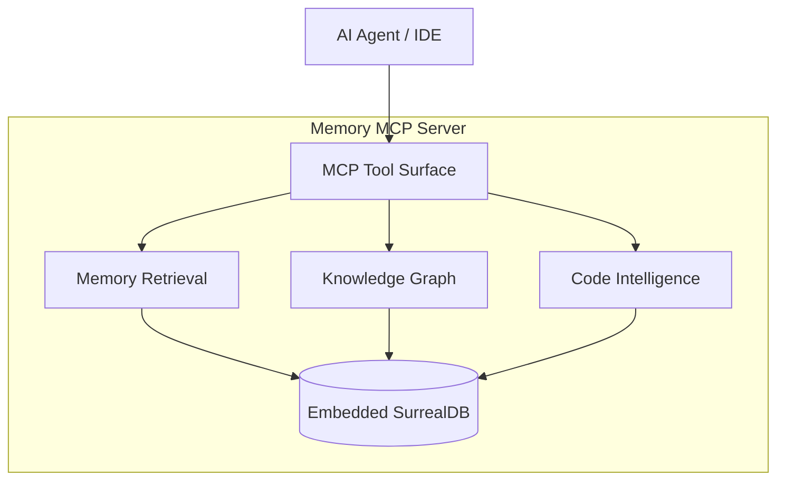

# Memory MCP Server

[](https://github.com/SteinX/memory-mcp-1file/actions/workflows/release.yml)
[](https://github.com/SteinX/memory-mcp-1file/pkgs/container/memory-mcp-1file)
[](https://opensource.org/licenses/MIT)
[](https://www.rust-lang.org)

Memory MCP is a local-first Model Context Protocol server for AI agents. It
stores long-term memory, retrieves it with hybrid semantic search, tracks
knowledge-graph relationships, and indexes code for symbol-aware search.

It works with Claude Desktop, Claude Code, Gemini CLI, Cursor, OpenCode, Cline,
Roo Code, and other MCP-compliant clients.

## Core Highlights

| Area | What you get |
|---|---|
| Local-first runtime | One Rust server with embedded SurrealDB. No external database service is required. |
| Hybrid memory retrieval | Vector search, BM25, graph traversal, and RRF ranking through `recall` and `search_memory`. |
| Code intelligence | Static tree-sitter indexing, symbol search, code recall, and symbol-graph traversal. |
| Lifecycle-safe memory | Soft invalidation, explicit consolidation, preview/apply purge, and lineage summaries. |
| Agent restart support | `memory_bootstrap`, prefix-based task records, and an `AGENTS.md` protocol for context recovery. |
| Portable deployment | Docker image, native binaries, and a GitHub Packages npm wrapper. |

## Quick Start

### Docker For MCP Stdio Clients

```bash
docker run --init -i --rm --memory=4g \
  -v mcp-data:/data \
  -v "$(pwd):/project:ro" \
  ghcr.io/steinx/memory-mcp-1file:latest \
  memory-mcp --data-dir /data --stdio
```

This keeps the database and Docker model cache in the named `mcp-data` volume.
The project is mounted read-only at `/project` for code indexing.

### Local `npx`

The npm wrapper is published to GitHub Packages:

```bash
npx -y @steinx/memory-mcp-1file
```

If this is your first time using the package, configure the `@steinx` GitHub
Packages scope first. See [Client Configuration](./doc/client-configuration.md).

### HTTP Server

```bash
docker run -d \
  --name memory-mcp \
  --memory=3g \
  -p 8080:8080 \
  -v mcp-data:/data \
  -v /absolute/path/to/host/project:/project:ro \
  -e PROJECT_PATH=/project \
  ghcr.io/steinx/memory-mcp-1file:latest
```

HTTP clients can only index paths visible to the server process. In Docker,
mount the project and refer to the mounted path.

## Agent Protocol

Memory is only useful if the agent checks it consistently. This repository
includes [AGENTS.md](./AGENTS.md), a protocol for startup recovery, active-task
display, explicit memory prefixes, and documentation hygiene.

Minimal agent instruction:

```markdown
Read AGENTS.md at session start. Use memory_bootstrap when available; otherwise
search for active TASK records before continuing work. Keep README.md and
AGENTS.md aligned with real behavior when workflow or operator-facing semantics
change.
```

## Documentation Map

| Topic | Start here |
|---|---|
| Client setup | [doc/client-configuration.md](./doc/client-configuration.md) |
| Runtime configuration, model cache, metrics, Docker notes | [doc/runtime-configuration.md](./doc/runtime-configuration.md) |
| Code indexing, language support, degradation metadata | [doc/code-intelligence.md](./doc/code-intelligence.md) |
| MCP tools and lifecycle contracts | [doc/tools-reference.md](./doc/tools-reference.md) |
| Common failures and recovery steps | [doc/troubleshooting.md](./doc/troubleshooting.md) |
| Architecture | [ARCHITECTURE.md](./ARCHITECTURE.md) |
| Roadmap and research ideas | [doc/roadmap.md](./doc/roadmap.md) |

## Architecture At A Glance



## Main Tool Groups

| Group | Tools |
|---|---|
| Memory | `memory_bootstrap`, `store_memory`, `get_memory`, `update_memory`, `list_memories`, `get_valid`, `invalidate` |
| Retrieval | `recall`, `search_memory`, `memory_search_trace` |
| Code | `index_project`, `project_info`, `recall_code`, `search_symbols`, `symbol_graph` |
| Lifecycle | `consolidate_memory`, `preview_consolidate_memory`, `preview_purge_memory`, `purge_memory` |
| Migration | `export_memory`, `import_memory` |
| Diagnostics | `get_status`, `memory_audit`, `how_to_use` |

See [Tools Reference](./doc/tools-reference.md) for the full tool surface,
including learning memory, knowledge graph actions, and admin-only operations.

## Model Defaults

The default embedding model is `gemma`, a smaller Docker-friendly model. Model
files are downloaded from HuggingFace and cached locally:

- native runs use a durable platform app-data model cache by default;
- Docker runs cache models under `/data/models`, so a named `/data` volume
  preserves both data and model files;
- legacy `${data_dir}/models` caches are reused when present.

Model and dimension choices affect data compatibility. See
[Runtime Configuration](./doc/runtime-configuration.md) before changing models
on an existing data directory.

## Development Checks

```bash
cargo check
cargo test
```

For code-indexing-specific checks, see
[Code Intelligence](./doc/code-intelligence.md#verification-commands).

## License

MIT
