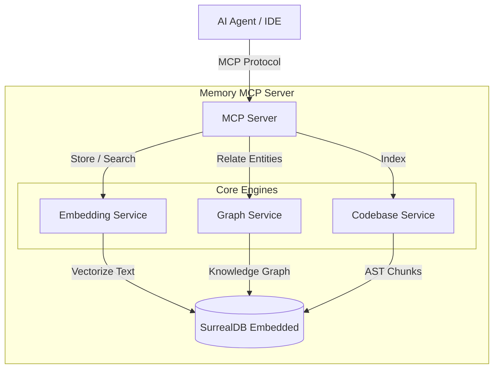

# 🧠 Memory MCP Server

[](https://github.com/pomazanbohdan/memory-mcp-1file/actions/workflows/release.yml)
[](https://github.com/pomazanbohdan/memory-mcp-1file/pkgs/container/memory-mcp-1file)
[](https://opensource.org/licenses/MIT)
[](https://www.rust-lang.org)
[](#)

A high-performance, **pure Rust** Model Context Protocol (MCP) server that provides persistent, semantic, and graph-based memory for AI agents.

Works perfectly with:
*   **Claude Desktop**
*   **Claude Code** (CLI)
*   **Gemini CLI**
*   **Cursor**
*   **OpenCode**
*   **Cline** / **Roo Code**
*   Any other MCP-compliant client.

### 🏆 The "All-in-One" Advantage

Unlike other memory solutions that require a complex stack (Python + Vector DB + Graph DB), this project is **a single, self-contained executable**.

*   ✅ **No External Database** (SurrealDB is embedded)
*   ✅ **No API Keys, No Cloud, No Python** — Everything runs **100% locally** via an embedded ONNX runtime. The embedding model is baked into the binary and runs on CPU. Nothing leaves your machine.
*   ✅ **Zero Setup** (Just run one Docker container or binary)

It combines:
1.  **Vector Search** (FastEmbed) for semantic similarity.
2.  **Knowledge Graph** (PetGraph) for entity relationships.
3.  **Code Indexing** with **symbol graph** (calls, extends, implements) for deep codebase understanding.
4.  **Hybrid Retrieval** (Reciprocal Rank Fusion) for best results.
5.  **Explicit consolidation** for exact duplicate memories via replacement links, without silently changing write semantics.
6.  **Preview / Apply Alignment** with `plan_fingerprint`, plus matched-summary and execution-summary fields so consolidation can be previewed, verified, and audited before and after execution.
7.  **Read-side Consolidation Traceability** so `get_memory`, `list_memories`, and `get_valid` expose a normalized `consolidation_trace` summary instead of forcing callers to reconstruct lifecycle state from raw fields.
8.  **Replacement Lineage Navigation** so read APIs also expose a compact `replacement_lineage` summary for following supersession chains without reconstructing them client-side.
9.  **Operator Attention Summaries** so preview/apply/read responses surface a compact `attention_summary` for multi-match, partial-supersede, lineage-cycle, truncation, and fingerprint-check signals without requiring callers to infer risk from raw fields.
10. **Retrieval/Read Truth Alignment** so `search_memory` and `recall` also surface consolidation truth summaries instead of requiring a second hop to `get_memory` before a caller can see lifecycle state.
11. **Plan Diagnostics Echo** so `preview_consolidate_memory` and `consolidate_memory` return a normalized `plan_diagnostics` view of the fingerprint inputs, making stale-plan mismatches explainable without reconstructing the plan by hand.
12. **Hash-First Duplicate Lookup** so exact-duplicate consolidation can narrow candidates by `content_hash` first, while still falling back to exact-content matching for older memories that predate create-time hashing.
13. **Lookup Diagnostics** so preview/apply responses explicitly show whether duplicate detection came from `hash-first` narrowing or `exact-content` fallback for legacy no-hash memories.
14. **Operator Summary** so preview/apply/read/retrieval responses expose one compact `operator_summary` entrypoint that tells clients which diagnostic section to inspect first.

### 🏗️ Architecture



> **[Click here for the Detailed Architecture Documentation](./ARCHITECTURE.md)**

---

## 🤖 Agent Integration (System Prompt)

Memory is useless if your agent doesn't check it. To get the "Long-Term Memory" effect, you must instruct your agent to follow a strict protocol.

We provide a battle-tested **[Memory Protocol (AGENTS.md)](./AGENTS.md)** that you can adapt.

### 🛡️ Core Workflows (Context Protection)

The protocol implements specific flows to handle **Context Window Compaction** and **Session Restarts**:

1.  **🚀 Session Startup**: The agent *must* search for `TASK: in_progress` immediately. This restores the full context of what was happening before the last session ended or the context was compacted.
2.  **⏳ Auto-Continue**: A safety mechanism where the agent presents the found task to the user and waits (or auto-continues), ensuring it doesn't hallucinate a new task.
3.  **🔄 Triple Sync**: Updates **Memory**, **Todo List**, and **Files** simultaneously. If one fails (e.g., context lost), the others serve as backups.
4.  **🧱 Prefix System**: All memories use prefixes (`TASK:`, `DECISION:`, `RESEARCH:`) so semantic search can precisely target the right type of information, reducing noise.

These workflows turn the agent from a "stateless chatbot" into a "stateful worker" that survives restarts and context clearing.

### Recommended System Prompt Snippet

Instead of scattering instructions across IDE-specific files (like `.cursorrules`), establish `AGENTS.md` as the **Single Source of Truth**.

Instruct your agent (in its base system prompt) to:
1.  **Read `AGENTS.md`** at the start of every session.
2.  **Follow the protocols** defined therein.

Here is a minimal reference prompt to bootstrap this behavior:

```markdown
# 🧠 Memory & Protocol
You have access to a persistent memory server and a protocol definition file.

1.  **Protocol Adherence**:
    - READ `AGENTS.md` immediately upon starting.
    - Strictly follow the "Session Startup" and "Sync" protocols defined there.

2.  **Context Restoration**:
    - Run `search_text("TASK: in_progress")` to restore context.
    - Do NOT ask the user "what should I do?" if a task is already in progress.
```

### Why this matters?
Without this protocol, the agent loses context after compaction or session restarts. With this protocol, it maintains the **full context of the current task**, ensuring no steps or details are lost, even when the chat history is cleared.

---

## 🔌 Client Configuration

### Universal Docker Configuration (Any IDE/CLI)

To use this MCP server with any client (**Claude Code**, **OpenCode**, **Cline**, etc.), use the following Docker command structure.

**Key Requirements:**
1.  **Memory Volume**: `-v mcp-data:/data` (Persists your graph, embeddings, **and cached model weights**)
2.  **Project Volume**: `-v $(pwd):/project:ro` (Allows the server to read and index your code)
3.  **Init Process**: `--init` (Ensures the server shuts down cleanly)

> [!TIP]
> **One volume persists everything**: The single `-v mcp-data:/data` mount covers both the SurrealDB database **and** the ~1.2 GB embedding model (stored under `/data/models/`). There is no need for a separate volume for `/data/models` — it is already a subdirectory of `/data` and is preserved automatically. Without a named volume, Docker creates a new anonymous volume on each `docker run`, causing the model to re-download (~1.2 GB) every time.

#### JSON Configuration (Claude Desktop, etc.)

Add this to your configuration file (e.g., `claude_desktop_config.json`):

```json
{
  "mcpServers": {
    "memory": {
      "command": "docker",
      "args": [
        "run",
        "--init",
        "-i",
        "--rm",
        "--memory=3g",
        "-v", "mcp-data:/data",
        "-v", "/absolute/path/to/your/project:/project:ro",
        "ghcr.io/pomazanbohdan/memory-mcp-1file:latest",
        "--stdio"
      ]
    }
  }
}
```

> **Note:** Replace `/absolute/path/to/your/project` with the actual path you want to index. In some environments (like Cursor or VSCode extensions), you might be able to use variables like `${workspaceFolder}`, but absolute paths are most reliable for Docker.

### Cursor (Specific Instructions)

1.  Go to **Cursor Settings** > **Features** > **MCP Servers**.
2.  Click **+ Add New MCP Server**.
3.  **Type**: `stdio`
4.  **Name**: `memory`
5.  **Command**:
    ```bash
    docker run --init -i --rm --memory=3g -v mcp-data:/data -v "/Users/yourname/projects/current:/project:ro" ghcr.io/pomazanbohdan/memory-mcp-1file:latest --stdio
    ```
    *(Remember to update the project path when switching workspaces if you need code indexing)*

### OpenCode / CLI

```bash
docker run --init -i --rm --memory=3g \
  -v mcp-data:/data \
  -v $(pwd):/project:ro \
  ghcr.io/pomazanbohdan/memory-mcp-1file:latest \
  --stdio
```

> [!NOTE]
> The published Docker image defaults to **HTTP SSE** mode for standalone/server use. When wiring it into MCP desktop or CLI clients, append `--stdio` as shown above so the container speaks the stdio transport the client expects.

### NPX / Bunx (No Docker required)

You can run the server directly via `npx` or `bunx`. The npm package automatically downloads the correct pre-compiled binary for your platform.

#### Claude Desktop

Add to `claude_desktop_config.json`:

```json
{
  "mcpServers": {
    "memory": {
      "command": "npx",
      "args": ["-y", "memory-mcp-1file"]
    }
  }
}
```

#### Claude Code (CLI)

```bash
claude mcp add memory -- npx -y memory-mcp-1file
```

#### Cursor

1.  Go to **Cursor Settings** > **Features** > **MCP Servers**.
2.  Click **+ Add New MCP Server**.
3.  **Type**: `command`
4.  **Name**: `memory`
5.  **Command**: `npx -y memory-mcp-1file`

Or add to `.cursor/mcp.json`:

```json
{
  "mcpServers": {
    "memory": {
      "command": "npx",
      "args": ["-y", "memory-mcp-1file"]
    }
  }
}
```

#### Windsurf / VS Code

Add to your MCP settings:

```json
{
  "mcpServers": {
    "memory": {
      "command": "npx",
      "args": ["-y", "memory-mcp-1file"]
    }
  }
}
```

#### Bun

```json
{
  "mcpServers": {
    "memory": {
      "command": "bunx",
      "args": ["memory-mcp-1file"]
    }
  }
}
```

> **Note:** Unlike Docker, `npx`/`bunx` runs the binary **locally** — it already has access to your filesystem, so no directory mounting is needed. To customize the data storage path, pass `--data-dir` via args:
> ```json
> "args": ["-y", "memory-mcp-1file", "--", "--data-dir", "/path/to/data"]
> ```

### Gemini CLI

Add to your `~/.gemini/settings.json`:

```json
{
  "mcpServers": {
    "memory": {
      "command": "npx",
      "args": ["-y", "memory-mcp-1file"]
    }
  }
}
```

Or with Docker:

```json
{
  "mcpServers": {
    "memory": {
      "command": "docker",
      "args": [
        "run", "--init", "-i", "--rm", "--memory=3g",
        "-v", "mcp-data:/data",
        "-v", "${workspaceFolder}:/project:ro",
        "ghcr.io/pomazanbohdan/memory-mcp-1file:latest",
        "--stdio"
      ]
    }
  }
}
```

---

## ✨ Key Features

- **Semantic Memory**: Stores text with vector embeddings (`gemma` by default, `qwen3` available) for "vibe-based" retrieval.
- **Governed Memory Retrieval**: Memory APIs now share first-class optional filters for `user_id`, `agent_id`, `run_id`, `namespace`, `memory_type`, metadata, and time windows. `list_memories` uses the same governance path and returns a filtered `total`.
- **Memory Lexical Engine**: Memory BM25-style retrieval now uses a reusable in-memory lexical index that is warmed from DB at startup and kept in sync by memory CRUD / invalidation flows, instead of rebuilding the lexical model on every request.
- **Layered Diagnostics**: Memory search/recall diagnostics expose retrieved candidates, post-filter hits, and returned hits; `metadata_filter` is explicitly reported as post-query subset matching.
- **Importance-aware Recall**: `importance_score` participates in memory ranking, so promoted memories can outrank equally matching low-priority ones.
- **Replacement Links Preserved**: `invalidate(..., superseded_by=...)` now round-trips on reads, so replacement chains survive retrieval and inspection.
- **Consolidation Preview**: `preview_consolidate_memory` shows exact-duplicate matches, replacement scope, and supersede reason before any write occurs.
- **Graph Memory**: Tracks entities (`User`, `Project`, `Tech`) and their relations (`uses`, `likes`). Supports PageRank-based traversal.
- **Code Intelligence**: Indexes local project directories (AST-based chunking) for Rust, Python, TypeScript, JavaScript, Go, Java, and **Dart/Flutter**. Tracks **calls, imports, extends, implements, and mixin** relationships between symbols.
- **Plugin-Facing Contract Freeze**: Code/project read surfaces expose additive `contract` + `summary` metadata with a machine-readable `reason_code` taxonomy (`missing`, `stale`, `partial`, `degraded`, `invalid_locator`, `generation_mismatch`, `unsupported`) while preserving legacy string `reason` fields for compatibility.
- **Explicit Projection Locator Lifecycle**: `project_info(action="projection")` returns an ephemeral locator record with typed lifecycle and lookup metadata, and `project_info(action="projection_by_locator")` returns the same contract on resolve/miss without promoting locators to stable public IDs.
- **Temporal Validity**: Memories can have `valid_from` and `valid_until` dates.
- **SurrealDB Backend**: Fast, embedded, single-file database.

---

## 🛠️ Tools Available

The server exposes **18 tools** to the AI model, organized into logical categories.

### 🧠 Core Memory Management
| Tool | Description |
|------|-------------|
| `store_memory` | Store a new memory with content, optional scope fields, metadata, and optional `importance_score`. Read/list surfaces now also expose additive `contract` + `summary` metadata. |
| `update_memory` | Update memory fields, including scope and `importance_score`. |
| `delete_memory` | Delete memory by ID. |
| `preview_consolidate_memory` | Preview exact-duplicate consolidation without writing any changes. |
| `list_memories` | List memories (newest first) with optional scope/type/metadata/time filters; `total` is the filtered total. Also returns additive `contract` + normalized `summary` metadata. |
| `get_memory` | Get full memory by ID. Memory IDs are the stable public identity on memory read/list surfaces. |
| `invalidate` | Soft-delete memory, optionally linking replacement via `superseded_by`. |
| `get_valid` | Get valid memories with optional point-in-time, scope, metadata, and time-window filters. Also returns additive `contract` + normalized `summary` metadata. |

### 🔎 Search & Retrieval
| Tool | Description |
|------|-------------|
| `recall` | **Hybrid memory retrieval** (Vector + lexical + Graph via RRF) with layered diagnostics and optional filters. Retrieval surfaces also expose additive `contract` + `summary` metadata. |
| `search_memory` | Search memories. `mode`: `vector` (default) or `bm25`; BM25 mode uses the reusable in-memory memory lexical engine. Returned memory IDs remain the stable public memory identity. |

### 🕸️ Knowledge Graph
| Tool | Description |
|------|-------------|
| `knowledge_graph` | Unified KG operations. `action`: `create_entity` \| `create_relation` \| `get_related` \| `detect_communities`. `get_related` now returns exported `nodes` / `edges`, additive `contract` + `summary` metadata, and keeps legacy `entities` / `relations` only for compatibility. |

### 💻 Codebase Intelligence
| Tool | Description |
|------|-------------|
| `index_project` | Index codebase directory for code search. |
| `delete_project` | Delete indexed project. |
| `recall_code` | Code retrieval. `mode`: `vector` or `hybrid` (default). Hybrid uses vector+BM25+graph fusion. Results now expose additive `contract` + `summary` metadata. **Important:** `results[].id` is a local chunk-record reference, not a stable public ID; the stable re-find locator is `project_id + file_path + start_line + end_line`. |
| `search_symbols` | Search code symbols by name. Search responses expose additive `contract` + `summary` metadata; symbol IDs are stable project-scoped symbol identities. |
| `symbol_graph` | Navigate symbol graph. `action`: `callers` \| `callees` \| `related`. Related traversal exposes exported `nodes` / `edges`, additive `contract` + `summary`, and keeps legacy `symbols` / `relations` for compatibility. `frontier` is an unexpanded boundary hint, **not** a cursor. |
| `project_info` | Project info. `action`: `list` \| `status` \| `stats` \| `projection` \| `projection_by_locator`. Status/list/stats surfaces expose additive `contract` + normalized `summary`, including lifecycle, generation, and projection/materialization contract metadata. `projection` returns an on-demand export plus an ephemeral locator record; `projection_by_locator` resolves that locator only within the same process and now returns typed locator lookup/lifecycle metadata on both success and miss. |

### Contract compatibility notes for plugin / MCP integrators

- `contract` and `summary` remain **additive-first** surfaces. Clients must ignore unknown fields and unknown enum values.
- `summary.partial.reason_code` is the canonical machine-readable contract reason. Current Phase 5A values are: `missing`, `stale`, `partial`, `degraded`, `invalid_locator`, `generation_mismatch`, and `unsupported`.
- `summary.partial.reason` is retained as a legacy compatibility string. Existing values like `projection_stale`, `indexing_in_progress`, and `progress:NN.N` remain readable, but new integrations should key off `reason_code`.
- `project_info(action="projection")` returns `locator.lookup.state = "created"`; `project_info(action="projection_by_locator")` returns `locator.lookup.state = "resolved"` on success and `"missing"` on miss.
- Projection locators are **opaque, same-process, non-persistable, and not generation-stable**. They are convenience handles for immediate readback, not stable public identities.
- Stable identities remain unchanged:
  - memory read/list/search surfaces → public memory IDs
  - symbol graph/search surfaces → stable project-scoped symbol IDs
  - `recall_code` re-find contract → `project_id + file_path + start_line + end_line`

### ⚙️ System & Maintenance
| Tool | Description |
|------|-------------|
| `get_status` | Get system status and startup progress. |
| `reset_all_memory` | **DANGER**: Reset all database data (requires `confirm=true`). |

---

## ⚙️ Configuration

Environment variables or CLI args:

| Arg | Env | Default | Description |
|-----|-----|---------|-------------|
| `--data-dir` | `DATA_DIR` | platform-local app data dir (`memory-mcp`) | DB location |
| `--model` | `EMBEDDING_MODEL` | `gemma` | Embedding model (`qwen3`, `gemma`, `bge_m3`, `nomic`, `e5_multi`, `e5_small`) |
| `--mrl-dim` | `MRL_DIM` | *(native)* | Output dimension for MRL-supported models (e.g. 64, 128, 256, 512, 1024 for Qwen3). Defaults to the model's native maximum dimension (1024 for Qwen3). |
| `--batch-size` | `BATCH_SIZE` | `8` | Maximum batch size for embedding inference |
| `--cache-size` | `CACHE_SIZE` | `1000` | LRU cache capacity for embeddings |
| `--timeout` | `TIMEOUT_MS` | `30000` | Timeout in milliseconds |
| `--idle-timeout` | `IDLE_TIMEOUT` | `0` | Idle timeout in minutes. 0 = disabled |
| `--log-level` | `LOG_LEVEL` | `info` | Verbosity |
| `--log-file` | `LOG_FILE` | *(None)* | Log file path. If specified, logs will be written to this file in addition to stderr. The file will be rotated when it reaches the maximum size. Rotated files are named with startup timestamp (e.g., `app.2026-04-09_14-30-00.log.1`). |
| `--log-file-max-size-mb` | `LOG_FILE_MAX_SIZE_MB` | `10` | Maximum log file size in MB before rotation. Only effective when `--log-file` is specified. |
| *(None)* | `HF_TOKEN` | *(None)* | Optional HuggingFace token for private/rate-limited model downloads |
| *(None)* | `EMBEDDING_QUEUE_CAPACITY` | `256` | Max size of the background embedding queue |
| *(None)* | `EMBEDDING_BATCH_SIZE` | `8` | How many files to process in one embedding chunk |
| *(None)* | `INDEX_BATCH_SIZE` | `20` | How many files to process in one incremental chunk |
| *(None)* | `INDEX_DEBOUNCE_MS` | `2000` | MS to wait before flushing index events (debounce) |
| *(None)* | `MANIFEST_DIFF_INTERVAL_MINS` | `10` | Minutes between periodic missing file checks |

### 🧠 Available Models

You can switch the embedding model using the `--model` arg or `EMBEDDING_MODEL` env var.

| Argument Value | HuggingFace Repo | Dimensions | Size | Use Case |
| :--- | :--- | :--- | :--- | :--- |
| `qwen3` | `Qwen/Qwen3-Embedding-0.6B` | 1024 (MRL) | 1.2 GB | Highest-quality bundled option. Larger download and storage footprint. |
| `gemma` | `unsloth/embeddinggemma-300m-qat-q4_0-unquantized` | 768 (MRL) | ~195 MB | **Default**. Smaller download, lower RAM, good Docker-friendly baseline. |
| `bge_m3` | `BAAI/bge-m3` | 1024 | 2.3 GB | State-of-the-art multilingual hybrid retrieval. Heavy. |
| `nomic` | `nomic-ai/nomic-embed-text-v1.5` | 768 | 1.9 GB | High quality long-context BERT-compatible. |
| `e5_multi` | `intfloat/multilingual-e5-base` | 768 | 1.1 GB | Legacy; kept for backward compatibility. |
| `e5_small` | `intfloat/multilingual-e5-small` | 384 | 134 MB | Fastest, minimal RAM. Good for dev/testing. |

### 📉 Matryoshka Representation Learning (MRL)

Models marked with **(MRL)** support dynamically truncating the output embedding vector to a smaller dimension (e.g., 512, 256, 128) with minimal loss of accuracy. This saves database storage and speeds up vector search.

Use the `--mrl-dim` argument to specify the desired size. If omitted, the default is the model's native base dimension (e.g., 1024 for Qwen3).

**Warning:** Once your database is created with a specific dimension, you cannot change it without wiping the data directory.

### 📦 Model Selection Notes

By default, the server uses **Gemma** because it is the lightest bundled model and starts more comfortably in Docker-sized environments.

To use Gemma explicitly:

```bash
memory-mcp --model gemma
```

Gemma currently works out of the box with the bundled downloader. `HF_TOKEN` is still optional and can help with higher rate limits or private/rate-limited HuggingFace access, but the current server code does not require any separate Gemma-specific license-acceptance flow.

If you want the highest-quality bundled model instead, switch to **Qwen3** explicitly:

```bash
memory-mcp --model qwen3
```

When running in Docker, remember that changing models also changes embedding dimensions and storage requirements. Reuse the same `/data` volume only when the stored data was created with the same model/dimension settings.

### 🐳 Docker Image Notes

- The published image defaults to **HTTP SSE** on port `8080` and binds to `0.0.0.0`, so `-p 8080:8080` works as expected.
- MCP desktop/CLI integrations should append `--stdio`, because those clients speak stdio rather than HTTP.
- The release pipeline now publishes both **linux/amd64** (`x86_64-unknown-linux-musl`) and **linux/arm64** (`aarch64-unknown-linux-musl`) artifacts, and the published container image resolves the correct binary per target architecture.

> [!WARNING]
> **Changing Models & Data Compatibility**
>
> If you switch to a model with different dimensions (e.g., from `e5_small` to `e5_multi`), **your existing database will be incompatible**.
> You must delete the data directory (volume) and re-index your data.
>
> Switching between models with the same dimensions (e.g., `e5_multi` <-> `nomic`) is theoretically possible but not recommended as semantic spaces differ.

## 🔮 Future Roadmap (Research & Ideas)

### Current roadmap status
- ✅ **Phase 0 — Baseline Foundations** complete
- ✅ **Phase 1 — Canonical Contract Foundation** complete
- ✅ **Phase 2 — Public Surface Normalization** complete
- ✅ **Phase 3 — Later-Phase Contract Freeze + MVP Preparation** effectively complete for the MCP server repo
- ✅ **Phase 4 — Projection Builder (non-plugin scope)** effectively complete for the MCP server repo, including:
  - export-only on-demand projection build via `project_info(action="projection")`
  - deterministic builder flow and request/options contract
  - shaping semantics
  - ephemeral same-process locator + read-back path
- ⏸️ **Phase 5 — Plugin-facing Workflow Integration** is intentionally **out of scope for this repository** unless future work explicitly chooses to implement plugin-side workflow assets here.

### Repository closure status

From the MCP server repository perspective, the remaining work is now **closure and handoff**, not major new server capability work:

- the public contract layer (`contract` + `summary`) is already in place across memory, graph, code search, symbol, and project surfaces;
- projection/materialization semantics are explicit, but still truthfully non-persistent and non-addressable beyond same-process ephemeral locator read-back;
- stable vs transient identity rules are already frozen and documented;
- plugin orchestration, cache policy, stale UX, retry policy, and workflow commands are expected to live **outside this repo**.

See also:
- [`ARCHITECTURE.md`](./ARCHITECTURE.md) — plugin-facing MCP contract notes
- `SERVER_PLUGIN_BOUNDARY_STATUS.md` — final repo-side closure and handoff status
- `PLUGIN_IMPLEMENTATION_PLAN.md` — detailed plugin-side implementation plan

Based on analysis of advanced memory systems like [Hindsight](https://hindsight.vectorize.io/) (see their documentation for details on these mechanisms), we are exploring these "Cognitive Architecture" features for future releases:

### 1. Meta-Cognitive Reflection (Consolidation)
*   **Problem:** Raw memories accumulate noise over time (e.g., 10 separate memories about fixing the same bug).
*   **Solution:** Implement a `reflect` background process (or tool) that periodicallly scans recent memories to:
    *   **De-duplicate** redundant entries.
    *   **Resolve conflicts** (if two memories contradict, keep the newer one or flag for review).
    *   **Synthesize** low-level facts into high-level "Insights" (e.g., "User prefers Rust over Python" derived from 5 code choices).

### 2. Temporal Decay & "Presence"
*   **Problem:** Old memories can sometimes drown out current context in semantic search.
*   **Solution:** Integrate **Time Decay** into the Reciprocal Rank Fusion (RRF) algorithm.
    *   Give a calculated boost to recent memories for queries implying "current state".
    *   Allow the agent to prioritize "working memory" over "historical archives" dynamically.

### 3. Namespaced Memory Banks
*   **Problem:** Running one docker container per project is resource-heavy.
*   **Solution:** Add support for `namespace` or `project_id` scoping.
    *   Allows a single server instance to host isolated "Memory Banks" for different projects or agent personas.
    *   Enables "Switching Context" without restarting the container.

### 4. Epistemic Confidence Scoring
*   **Problem:** The agent treats a guess the same as a verified fact.
*   **Solution:** Add a `confidence` score (0.0 - 1.0) to memory schemas.
    *   Allows storing hypotheses ("I think the bug is in auth.rs", confidence: 0.3).
    *   Retrieval tools can filter out low-confidence memories when answering factual questions.

---

## License

MIT
